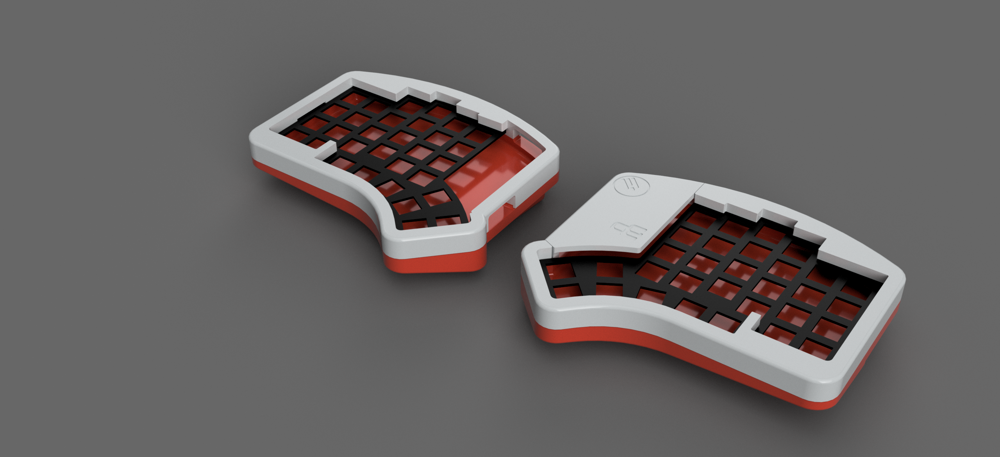

# Elora-3DP-case
Free STL file for a 3dp Elora case

You can find STL file for 3DP Printing of this gasked mounted case for SplitKb Elora.
You'll also need some screws and insert :
* M2 x 8mm screws
* M2 x 3mm inserts for PLA such as https://www.3djake.fr/cnc-kitchen/inserts-filetes-m2-standard
* Poron gasket strips 2mm height / 4mm width as those I would recommend https://fr.aliexpress.com/item/1005005793344984.html 80x4x2mm choice

If you look closely on the top case, I drew some circles to help you put and melt the insert into plastic

